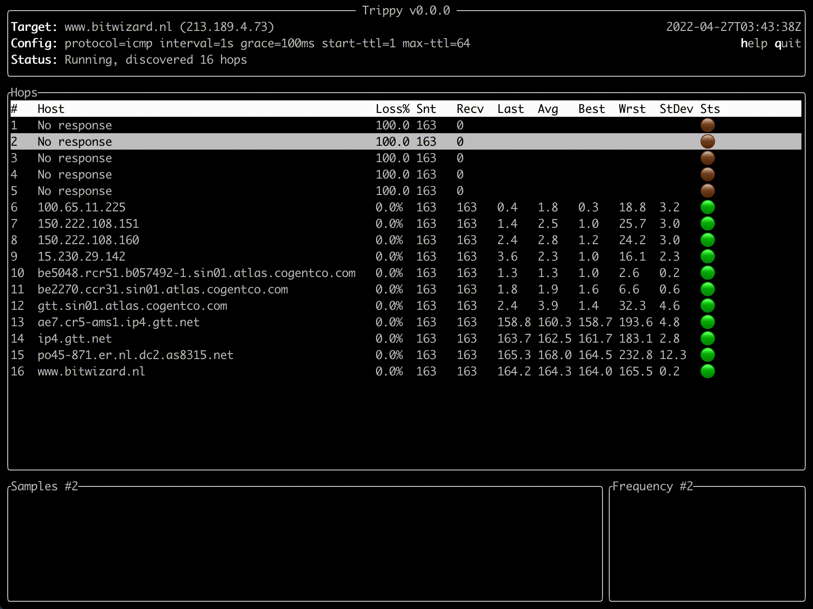

[](https://github.com/fujiapple852/trippy/actions/workflows/ci.yml)
[](https://crates.io/crates/trippy/0.1.0)

# Trippy

A network diagnostic tool, inspired by [mtr](https://github.com/traviscross/mtr).



## Features

Feature status and high level roadmap:

- Trace: ICMP protocol (✅)
- Trace: Adjustable packet size (✅)
- Trace: Adjustable payload pattern (✅)
- Trace: Adjustable starting and ended time-to-live values (✅)
- Trace: Adjustable minimum and maximum round trip time (✅)
- Trace: Adjustable round end grace period (✅)
- Trace: Adjustable maximum number of unknown hops (✅)
- Trace: Adjustable source port for `UDP` (✅)
- Trace: UDP protocol (✅)
- Trace: TCP protocol (✅)
- Trace: SCTP protocol ([#41](https://github.com/fujiapple852/trippy/issues/41))
- Trace: IPv6 ([#35](https://github.com/fujiapple852/trippy/issues/35))
- Trace: MPLS ([#33](https://github.com/fujiapple852/trippy/issues/33))
- Trace: Adjustable `DSCP` IP header ([#38](https://github.com/fujiapple852/trippy/issues/38))
- Trace: Adjustable network interface binding ([#42](https://github.com/fujiapple852/trippy/issues/42))
- Trace: Adjustable target port for `UDP`/`TCP` ([#43](https://github.com/fujiapple852/trippy/issues/43))
- Trace: Capabilities awareness (✅)
- Tui: Display core hop statistics (✅)
- Tui: hop navigation (✅)
- Tui: Pause display (✅)
- Tui: Help dialog (✅)
- Tui: Allow preserving screen on exit (✅)
- Tui: Adjustable refresh rate (✅)
- Tui: RTT history per hop (✅)
- Tui: RTT frequency histogram per hop (✅)
- Tui: Display multiple hosts per hop (✅)
- Tui: Reset statistics (✅)
- Tui: show Jitter ([#39](https://github.com/fujiapple852/trippy/issues/39))
- Tui: show top-N hosts per hop (✅)
- Tui: `AS` lookup ([#34](https://github.com/fujiapple852/trippy/issues/34))
- DNS: Basic reverse `DNS` lookup (✅)
- DNS: Non-blocking `DNS` resolver (✅)
- Report: `JSON` report mode (✅)
- Report: `CSV` report mode (✅)
- Report: Tabular report mode (✅)
- Report: Streaming text mode (✅)

## Distributions

### Cargo

```shell
cargo install trippy
```

### Docker (Linux only)

```shell
docker run -it fujiapple/trippy www.bitwizard.nl
```

## Platforms

Trippy has been (lightly...) tested on the following platforms:

| Platform       | Version         | Status |
|----------------|-----------------|--------|
| Linux (Ubuntu) | 20.04           | ✅      |
| macOS          | 11.4 (Big Sur)  | ✅      |
| BSD            | n/a             | TBC    |
| Windows        | n/a             | TBC    |

## Privileges

Trippy uses a raw socket which require elevated privileges.  Enabling the required privilege can be achieved in several 
ways, including:

1: Run as `root` user via `sudo`:

```shell
sudo trip www.bitwizard.nl
```

2: `chown` `trip` as the `root` user and set the `setuid` bit:

```shell
sudo chown root $(which trip) && sudo chmod +s $(which trip)
```

3: [Linux only] Set the `CAP_NET_RAW` capability:

```shell
sudo setcap CAP_NET_RAW+p $(which trip)
```

Trippy is a capability aware application and will add `CAP_NET_RAW` to the effective set if it is present in the allowed
set. Note that trippy will drop all capabilities after creating the raw socket.

## Usage Examples

Basic usage with default parameters:

```shell
trip www.bitwizard.nl
```

Trace using the `udp` protocol:

```shell
trip www.bitwizard.nl -p udp
```

Trace with a minimum round time of `250ms` and a grace period of `50ms`:

```shell
trip www.bitwizard.nl -i 250ms -g 50ms
```

Trace with a custom first and maximum `time-to-live`:

```shell
trip www.bitwizard.nl --first-ttl 2 --max-ttl 10
```

Generate a `json` tracing report with 10 rounds of data:

```shell
trip www.bitwizard.nl -m json -c 5
```

Perform DNS queries using the `google` DNS server (or `cloudflare`, `system`, `resolv`):

```shell
trip www.bitwizard.nl -r google
```

## Reference

```shell
USAGE:
    trip [OPTIONS] <HOSTNAME>

ARGS:
    <HOSTNAME>    The hostname or IP to scan

OPTIONS:
    -a, --tui-address-mode <TUI_ADDRESS_MODE>
            How to render addresses [default: host] [possible values: ip, host,
            both]

    -c, --report-cycles <REPORT_CYCLES>
            The number of report cycles to run [default: 10]

        --dns-timeout <DNS_TIMEOUT>
            The maximum time to wait to perform DNS queries [default: 5s]

        --first-ttl <FIRST_TTL>
            The TTL to start from [default: 1]

    -g, --grace-duration <GRACE_DURATION>
            The period of time to wait for additional ICMP responses after the
            target has responded [default: 100ms]

    -h, --help
            Print help information

    -i, --min-round-duration <MIN_ROUND_DURATION>
            The minimum duration of every round [default: 1s]

    -I, --max-round-duration <MAX_ROUND_DURATION>
            The maximum duration of every round [default: 1s]

        --initial-sequence <INITIAL_SEQUENCE>
            The initial sequence number [default: 33000]

    -m, --mode <MODE>
            Output mode [default: tui] [possible values: tui, stream, pretty,
            markdown, csv, json]

    -p, --protocol <PROTOCOL>
            Tracing protocol [default: icmp] [possible values: icmp, udp, tcp]

        --packet-size <PACKET_SIZE>
            The size of IP packet to send (IP header + ICMP header + payload)
            [default: 84]

        --payload-pattern <PAYLOAD_PATTERN>
            The repeating pattern in the payload of the ICMP packet [default: 0]

    -r, --dns-resolve-method <DNS_RESOLVE_METHOD>
            How to perform DNS queries [default: system] [possible values:
            system, resolv, google, cloudflare]

        --read-timeout <READ_TIMEOUT>
            The socket read timeout [default: 10ms]

        --source-port <SOURCE_PORT>
            The source port (TCP & UDP only)

    -t, --max-ttl <MAX_TTL>
            The maximum number of hops [default: 64]

        --tui-max-addresses-per-hop <TUI_MAX_ADDRESSES_PER_HOP>
            The maximum number of addresses to show per hop

        --tui-preserve-screen
            Preserve the screen on exit

        --tui-refresh-rate <TUI_REFRESH_RATE>
            The TUI refresh rate [default: 100ms]

    -U, --max-inflight <MAX_INFLIGHT>
            The maximum number of in-flight ICMP echo requests [default: 24]

    -V, --version
            Print version information
```

## Acknowledgement

Trippy is made possible by [tui-rs](https://github.com/fdehau/tui-rs)
, [crossterm](https://github.com/crossterm-rs/crossterm) & [pnet](https://github.com/libpnet/libpnet) as well as several
common foundational Rust libraries. It also draws heavily from [mtr](https://github.com/traviscross/mtr).

## Keyboard Controls

Press `h` in the Tui to display te keyboard controls.

## License

This project is distributed under the terms of the Apache License (Version 2.0).

Unless you explicitly state otherwise, any contribution intentionally submitted for inclusion in time by you, as defined
in the Apache-2.0 license, shall be licensed as above, without any additional terms or conditions.

See [LICENSE](LICENSE) for details.

Copyright 2022 [Trippy Contributors](https://github.com/fujiapple852/trippy/graphs/contributors)