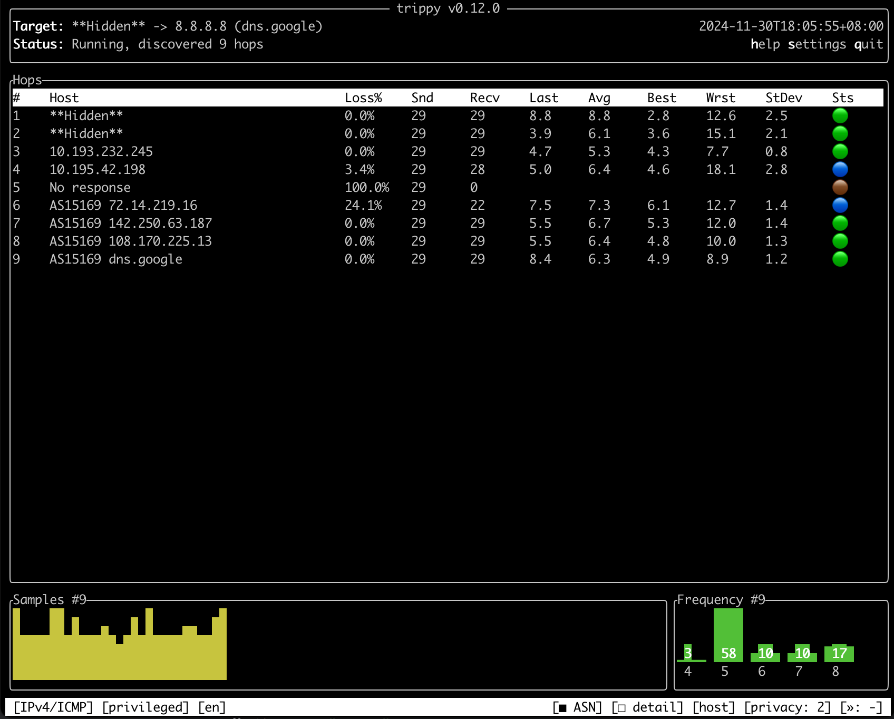
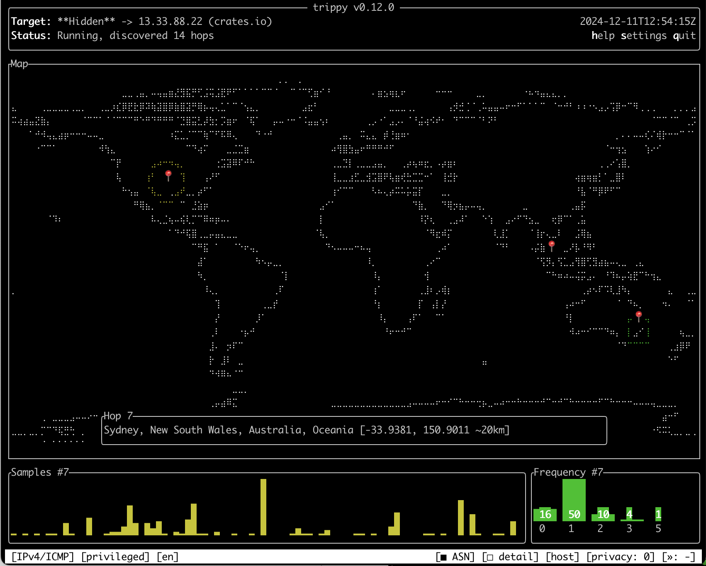
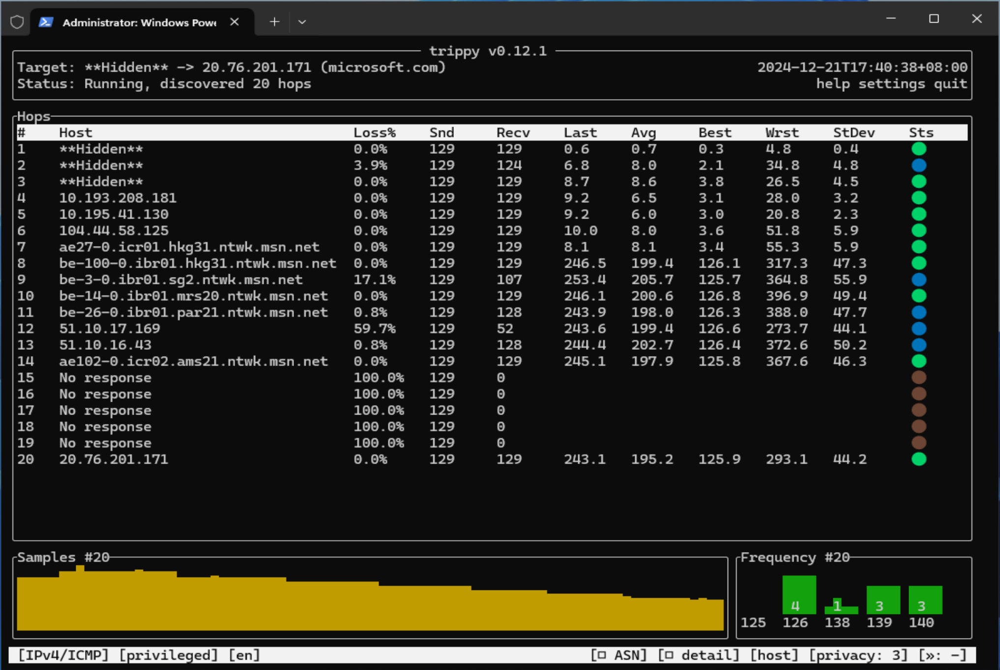
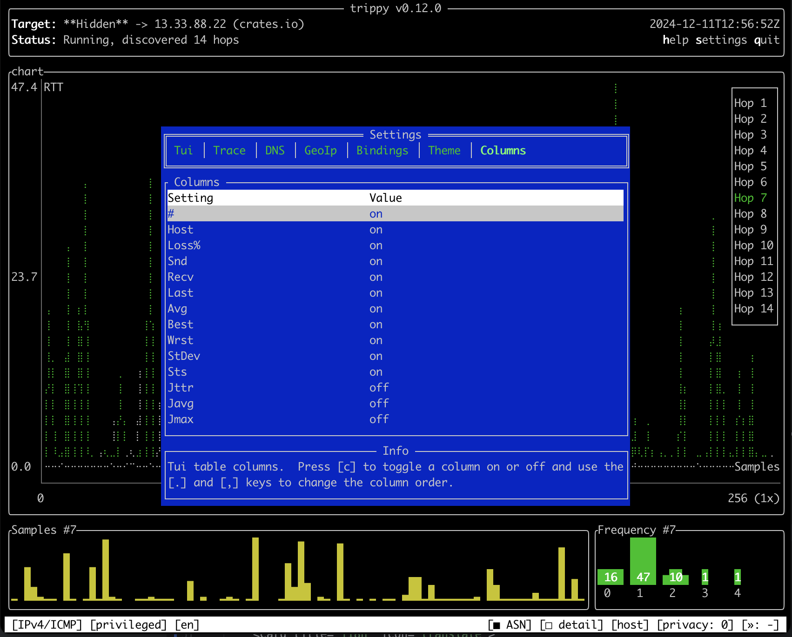
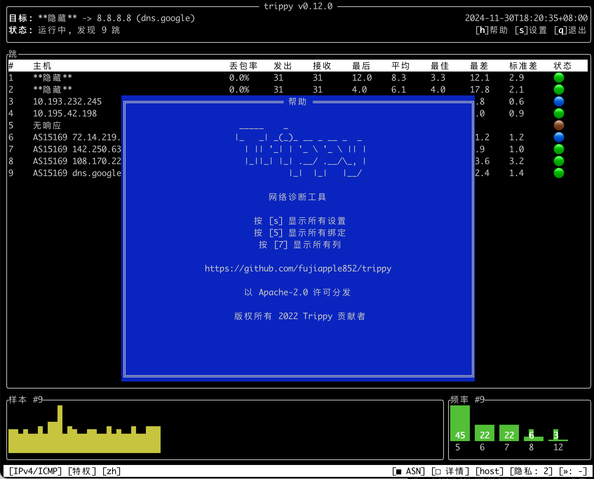

import { Card, CardGrid } from '@astrojs/starlight/components';
import { Icon } from '@astrojs/starlight/components';

<CardGrid stagger>
  <Card title="Powerful tracing features" icon="rocket">
    * `ICMP`, `UDP` & `TCP` over `IPv4` & `IPv6` protocols
    * Fully customizable tracing options
    * `dublin` and `paris` `ECMP` strategies
    * `ICMP` extensions objects (i.e. `MPLS`)
    * Reverse `DNS` and `ASN` lookups
    * `NAT` detection

    
  </Card>

  <Card title="Visualize GeoIp on a world map" icon="star">
    * Lookup GeoIp information and show on world map
    * Support for both `MaxMind` and `IPinfo` databases

    
  </Card>

  <Card title="Run on your platform" icon="star">
    * Runs on `Linux`, `macOS`, `Windows`, `*BSD`
    * Supports `x86_64`, `aarch64`, `arm7` architectures
    * Available from most native package managers
    * Run in unprivileged mode

    
  </Card>

  <Card title="Highly customizable TUI" icon="seti:config">
    * Customizable columns, color themes and key bindings
    * Hop detail navigation mode
    * Hop privacy mode
    * Show individual tracing flows
    * Various charts and statistics
    * Persist configuration to file

    
  </Card>

  <Card title="Trace in your language" icon="translate">
    TUI available in 10 languages:

    * Chinese 🇨🇳, English 🇺🇸, French 🇫🇷, German 🇩🇪, Italian 🇮🇹, Portuguese 🇵🇹, Russian 🇷🇺, Spanish 🇪🇸, Swedish 🇸🇪 and Turkish 🇹🇷

    
  </Card>
</CardGrid>
