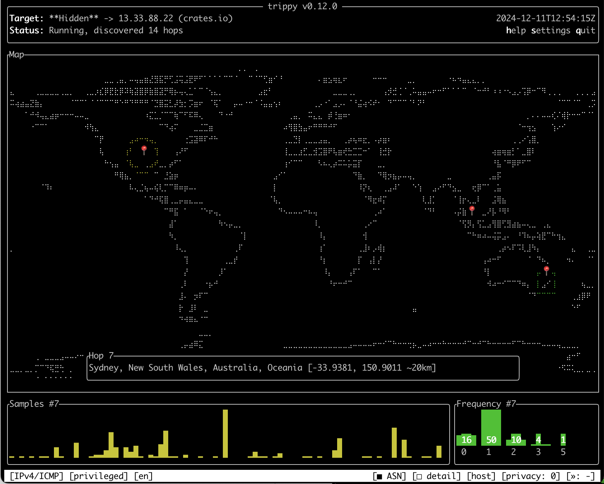
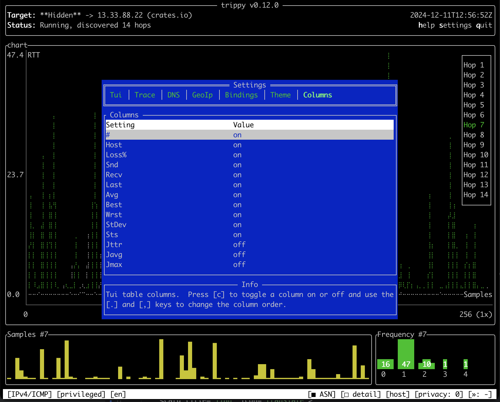

import { Card, CardGrid } from '@astrojs/starlight/components';
import { Icon } from '@astrojs/starlight/components';

<CardGrid stagger>
	<Card title="Powerful tracing features" icon="rocket">
	    - `ICMP`, `UDP` & `TCP` over `IPv4` & `IPv6` protocols
	    - Fully customizable tracing options
	    - `dublin` 🇮🇪 and `paris` 🇫🇷 ECMP algorithms
	    - `ICMP` extensions (e.g. `MPLS`)
	    - Reverse `DNS` and `ASN` lookups
	    - `NAT` detection
	    - Run in unprivileged mode

		
	</Card>

	<Card title="Visualize GeoIp on a world map" icon="star">
        - Lookup GeoIp information and show on world map
        - Support for both `MaxMind` and `IPinfo` databases

		
	</Card>

    <Card title="Run on your platform" icon="star">
        - Runs on `Linux`, `macOS`, `Windows`, `*BSD`
        - Supports `x86_64`, `aarch64`, `arm7` architectures
        - Available from most native package managers
        <CardGrid>
          <Card title="Linux">
            <Icon name="linux" size="8rem"/>
          </Card>
          <Card title="macOS">
            <Icon name="apple" size="8rem"/>
          </Card>
          <Card title="Windows">
            <Icon name="seti:windows" size="8rem"/>
          </Card>
          <Card title="*BSD">
            <Icon name="heart" size="8rem"/>
          </Card>
        </CardGrid>
    </Card>

	<Card title="Highly customizable TUI" icon="seti:config">
	    - Customizable columns, color themes and key bindings
	    - Hop detail navigation mode
	    - Hop privacy mode
	    - Show individual tracing flows
	    - Various charts and statistics
	    - Persist configuration to file

		
	</Card>

	<Card title="Trace in your language" icon="translate">
	    TUI translated into 10 languages:
	    - Chinese 🇨🇳, English 🇺🇸, French 🇫🇷, German 🇩🇪
	    - Italian 🇮🇹, Portuguese 🇵🇹, Russian 🇷🇺, Spanish 🇪🇸
	    - Swedish 🇸🇪 and Turkish 🇹🇷

		
	</Card>

</CardGrid>
